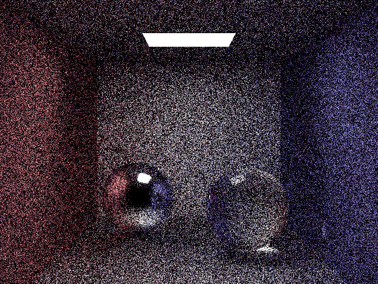
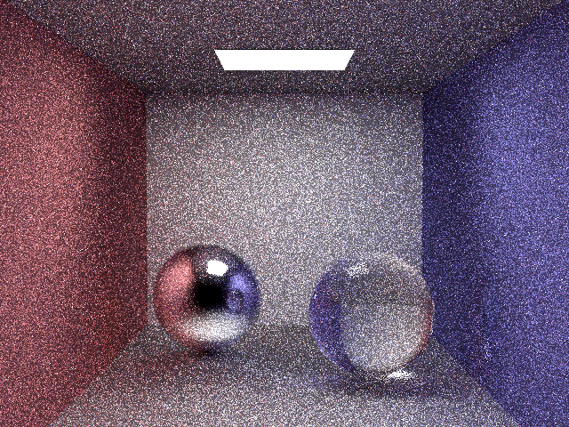
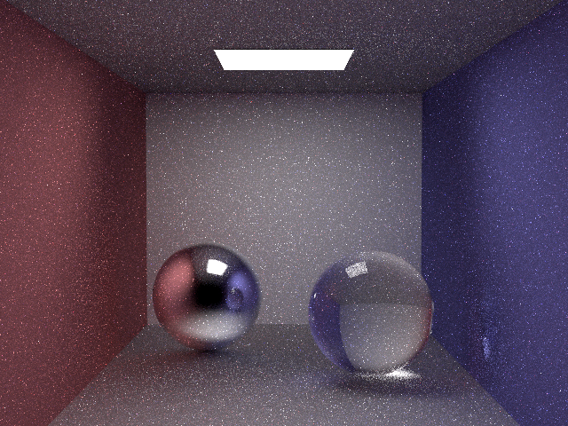

# RustRT - Yet another Rust Ray Tracer

I used this project to learn rust and Monte Carlo Ray Tracing.

To run the code use
`cargo run --release -- -s XXX`
where `XXX` is either a number (for example scenes) or a json file for a custom scenes.

The repository structure is the following

- src/core : Ray Tracing pluming
- src/integrators : Ray tracing algorithms
  - Naive Path Tracer
  - Next Event Estimation Path Tracer
  - Multiple Important Sampling Path Tracer
- src/materials : Materials
- src/samplers : Random number generator
- src/surfaces : Triangles, spheres, Rectangles, ...
- src/textures : Uniform color, Image, checher, ...
- scenes : scenes to try
- example_scene.rs : holds a few scenes for testing : to run use `cargo run --release -- -s 3`
- main.rs : entry point of the program

I used the crate `enum_delegate` to replace dynamic dispatch with enums. 

## Renders
I have included renders of the [Cornell Box scene](https://en.wikipedia.org/wiki/Cornell_box) scene using the path tracing algorithms I have implemented so far. All images are rendered using the name low number of samples per pixel.

### Naive Path Tracer

### Next Event Estimation (NEE) Path Tracer

### Multiple Important Sampling (MIS) Path Tracer

